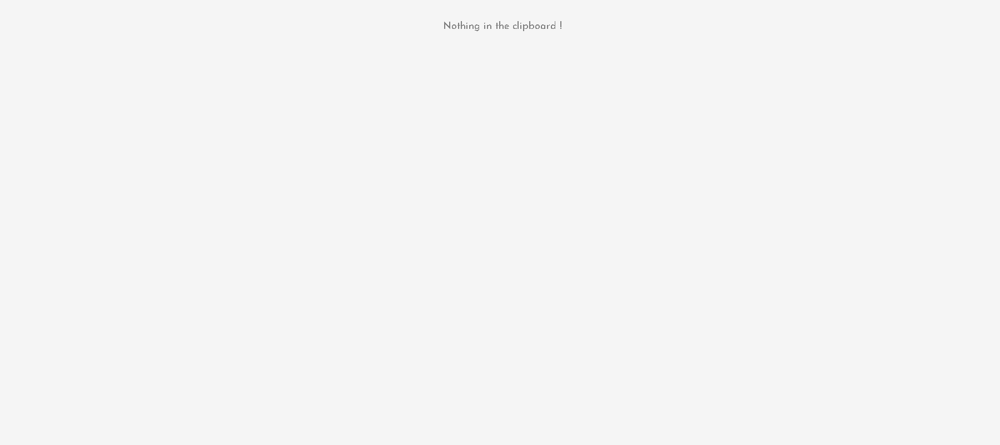
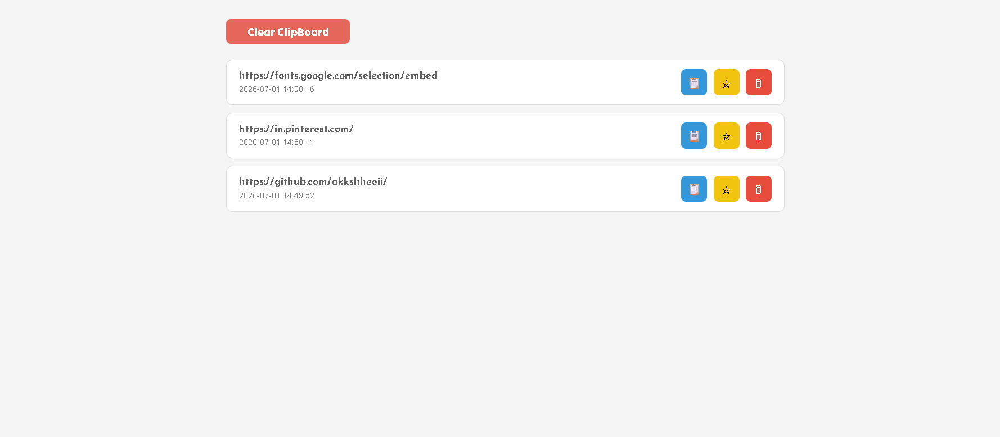
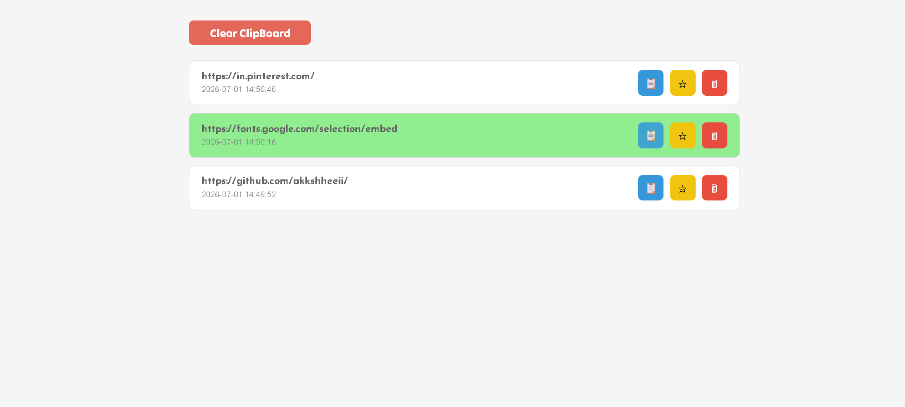
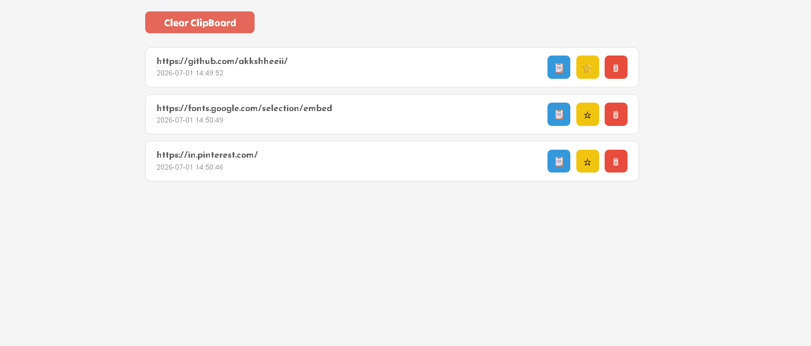

<div align="center">

### ClipBoard
Monitor • Store • Copy • Star • Manage


</div>


### `>About The Project`
```ClipBoard is an effieciet way to deal with out daily struggles of having
a single copy access - ClipBoard helps you to store upto 100 last Copies in
a database ( So it doesnt randomly disappear ) Which you can Access anytime.
Star your important once so they stay on the top - delete the useless and
clear after use
```

<div align="center">
  


  

</div>

### `> ScreenShots`


```
> Fresh  Clipboard
Simple Interface to visit your copies.
```


---
 
```
> On Copies
The copies and store in Descending Order So
you can deal with the latest one first
```



---

```
> Re Copy
Copy the Stored data to use again.
```



---

```
> Recent Activity
Displays latest uploaded files.
```




---

### `> Project Structure`

```
ClipBoard/

│
├── main.py
│
├── instance/
│      database.db
│
│
├── ClipBoard/
│      │
│      ├── __init__.py
│      ├── models.py
│      │
│      ├── templates/
│      │
│      └── static/
│
└── README.md
```

```bash
python main.py
```

### `> Database Models`

<b>  ClipBoard  </b>

```
id
content
password
timestamp
starred
```
